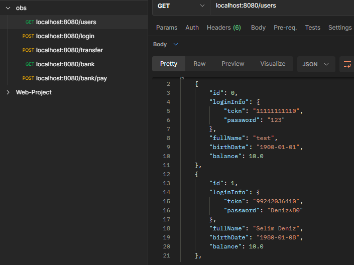
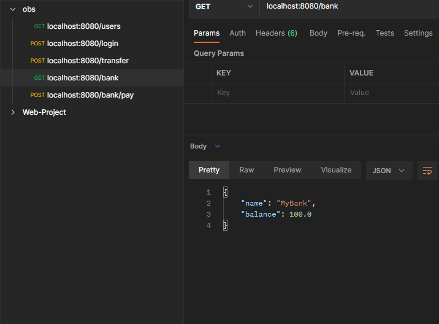
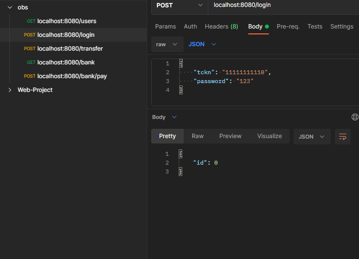
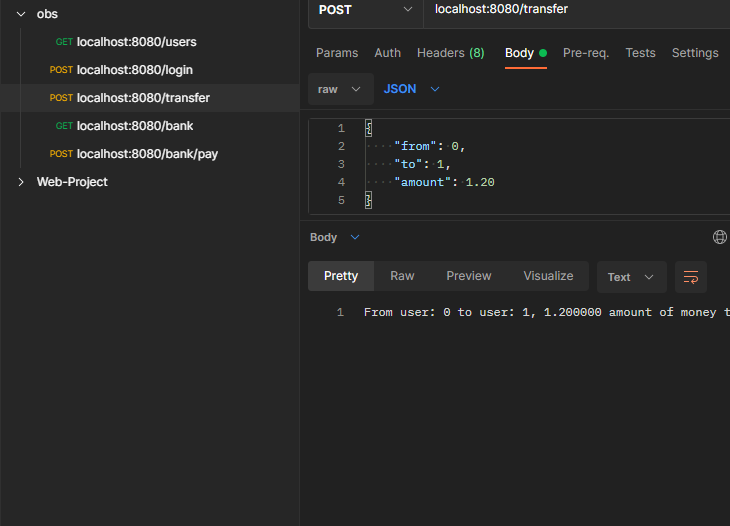
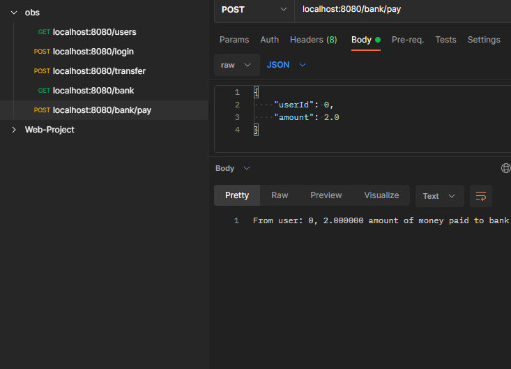
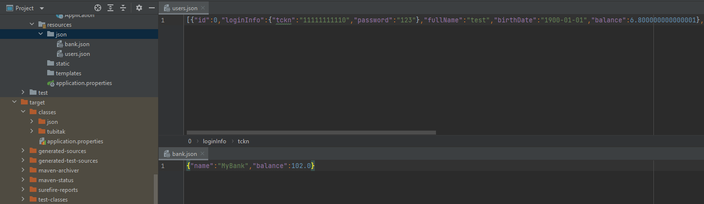

# Week 5 Homework
## Online Banking System

### Requirements
1. Create two models: Bank and User
2. Implement user login with T.C. and password
3. User passwords must not contain the birthdate.
4. Users can transfer money to each other.
5. User must be able to pay a loan payment or credit card statement to the bank.
6. The data must be read and processed in json formatted file.
7. The project should be built using classes.

### Screenshots

